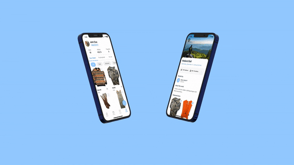
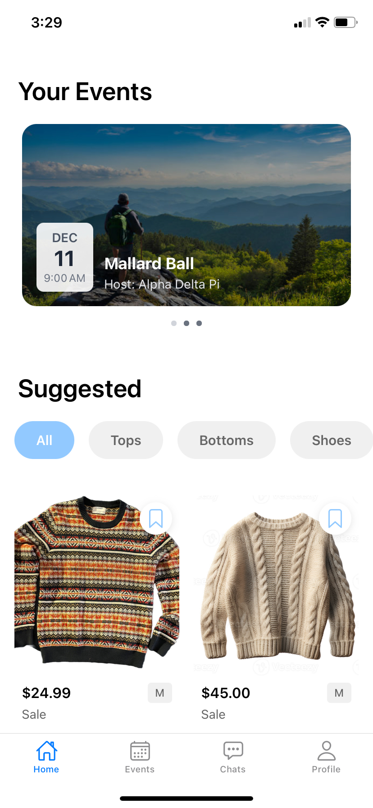
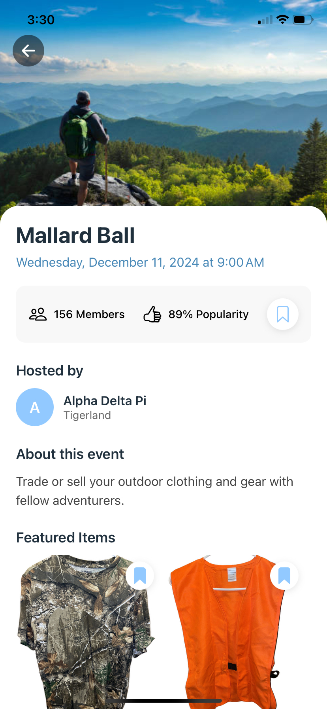
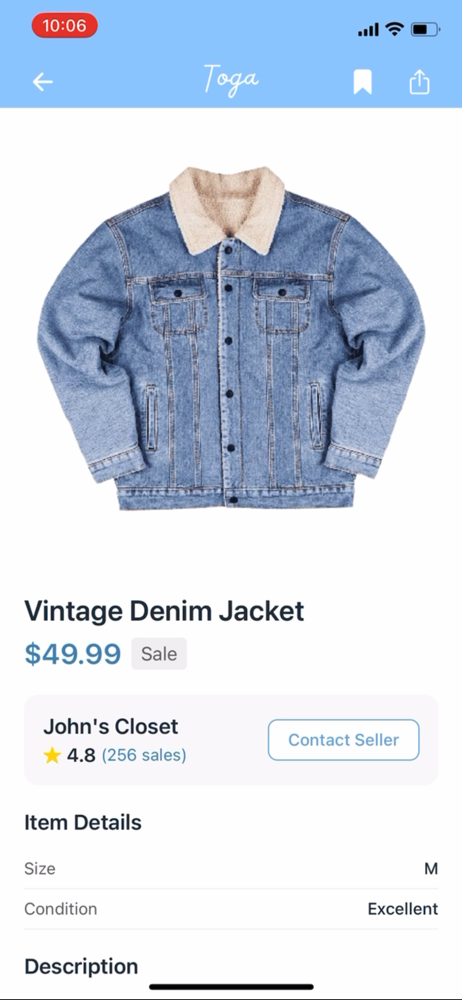
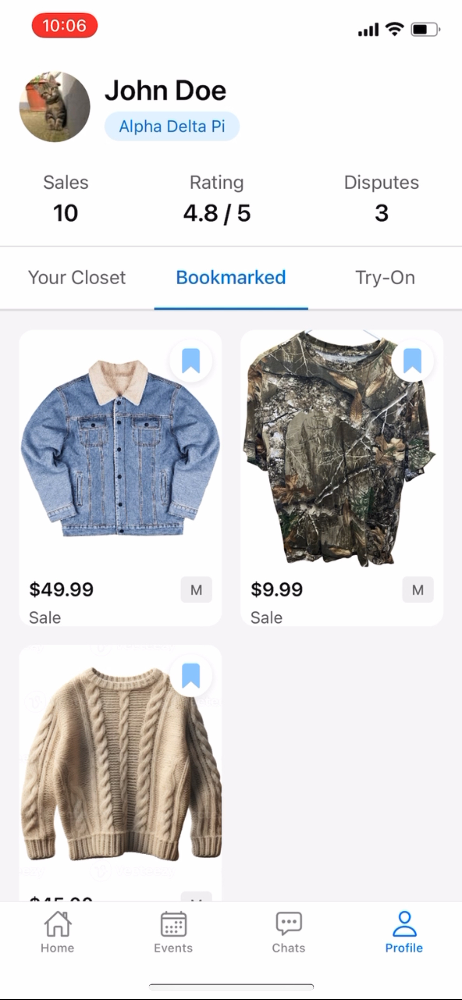
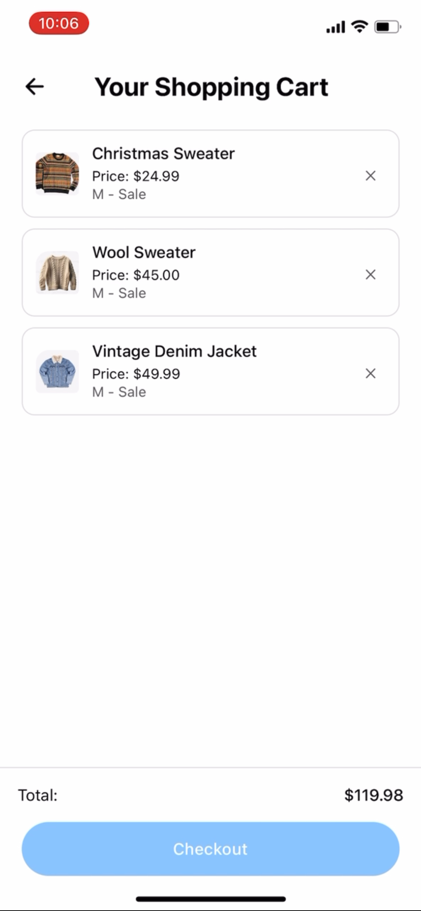

# Welcome to TOGA 👋

## Get started

1. Install dependencies

   ```bash
   npm install
   ```

2. Start the app

   ```bash
    npx expo start
   ```

In the output, you'll find options to open the app in a

- [development build](https://docs.expo.dev/develop/development-builds/introduction/)
- [Android emulator](https://docs.expo.dev/workflow/android-studio-emulator/)
- [iOS simulator](https://docs.expo.dev/workflow/ios-simulator/)
- [Expo Go](https://expo.dev/go), a limited sandbox for trying out app development with Expo

## Updated with Striple Integration

1. Open a new terminal (CTRL+SHIFT+`)

2. cd into \Toga\server

3. ```bash
    npm start
   ```

4. Look for the console log 'Server is running on port 8080'

5. Backend code can be located here: https://github.com/Cawde/backend-Toga

# TOGA - Event-Based Marketplace App

## App Demo
<div align="center">
  
</div>

## Features

### Event-Based Shopping


### Detailed Event View


### Product Listings


### User Profiles


### Shopping Cart


